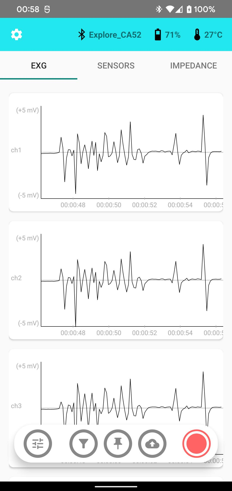

# Mentalab Explore Android app

## A Note on Formatting

This markdown file contains equations written in LaTeX, which GitHub refuses to render (unlike Gitlab...), so I suggest to download this file and just view it with something like VS Code.

## Introduction
The Mentalab Explore Android app is an app developed for Android, implemented in Kotlin and using SDK $\geq$ 24 (although minSDK can be set as low as 14 for the project to still build). It allows the user to connect to a previously paired Explore device and visualize its data streams in real time. The user can swipe between tab views to see charts displaying ExG data or sensor data (gyroscope, accelerometer, magnetometer). A tray at the bottom of the screen allows the user to perform quick actions, like setting a marker or pulling up visualization settings to change axis scales.

## Implementation
The implementation loosely follows a Model-View-Controller pattern, where the View are implemented by Android's Views and the corresponding XML files, the Model is implemented as a singleton in <code>Model.kt</code> and the Controller is the combination of the interfaces between the Model and the View/XML files (basically the implemented activities). The biggest part of the implementation is inside of <code>PagerAdapter.kt</code>, which handles the behaviour of the tabs as well as the cards inside the tabs and the linecharts within. The implemented classes that handle the drawing operations are <code>ChartView</code>, <code>ExGChart</code> and <code>Sensorchart</code>, where the last two inherit from <code>ChartView</code>, which handles variables and functionality that all chart have in common (like padding and drawing the axes). The settings screen is implemented in <code>Settings.kt</code>, however most of the options are currently not supported.

## Chart datapoint transformations
When we think of coordinate systems, we usually think of an x-axis that goes to the right and a y-axis that goes up, with coordinates taking on both negative and positive values. This is not the case for screens. Like most, if not all, screen coordinate systems, Android's coordinate system starts at the top left of the screen at the origin $(0.0f, 0.0f)$. Therefore, a few transformations have to be applied to have it displayed in the right spot. The transformation matrix for incoming ExG datapoints is as follows:
$\begin{pmatrix}
\frac{space\_horizontal}{xNum} & 0 & padding\_horizontal \\
0 & -s & s * avg + \frac{space\_vertical}{2} + padding\_vertical \\
0 & 0 & 1
\end{pmatrix}$
where...
* $s = \frac{space\_vertical}{range\_y}$,
* space_horizontal and space_vertical are the available height and width in which to draw the chart,
* xNum is the number of datapoints in the vector,
* range_y is the selected range in which the datapoints must be (i.e. 10mV) and
* padding_horizontal and padding_vertical describe the amount of padding between the chart and the edges of the view.

The first coefficient ($\frac{space\_horizontal}{xNum}$) shifts the incoming index of the datapoint along the x-axis, depending on how much space we have available. The entry at the top right translates the points to the right by the wanted padding. The real magic happens in the second row, where we first scale our datapoints with the factor $-s = - \frac{space\_vertical}{range\_y}$, which will mirror the incoming values along the x-Axis and then scale them such that they fall within our specified y-axis range. Our values are now scaled and centered around some average data point. To solve this problem, we center our points around the average over the points ($avg$) by adding the scaled average to our value. Now our values are actually, finally centered around 0 - which is the top edge of the View, so we're not done yet. To get them to the center of our chart, we need to translate them down by half the available space ($\frac{space\_vertical}{2}$) and finally add our padding. After doing this, we get the nice representation we can see in the image above.

The transformation of the sensor datapoints is done in a similar way, but we don't shift the datapoints by some average. Instead we scale them by the maximum recorded value over the sensor channels (X, Y and Z), which results in a much less convoluted matrix.

## Missing features
A lot of the features offered by the API are currently not (properly) implemented in the app. These are...
* enabling/disabling channels and modules
* setting the sample rate
* showing the firmware version (not supported by the API)
* importing data
* changing the time window at runtime
    - The time window can be set in the code, but to do this at runtime, a few constraints have to be considered
    - Changing the time window changes the number of displayed datapoints, which has to truncate existing datapoint lists (if necessary)
    - Additionally, the channel averages are averages over the current respective data list and truncating the list will lose information from the datapoints that are cut off
* filtering and filter options
* recording data
* pushing to LSL

## Other considerations
The current implementation assumes the app is only used with light theme and holding the phone vertically. Users of dark mode could be considered in the future, as well as landscape mode.
Also, it would be nice to have the icons for the battery and temperature change over time and reflect the current status.

## Known Bugs
1. Putting the app in the background for a while and coming back to it can lead to overlapping timestamps drawn on the x-axis. This is due to the fact that lists don't update while the app is in the background and so a new timestamp with bigger distance to previous timestamps is added and messes up the drawing of the timestamps. Timestamps are drawn according to the first and last timestamp in the list.
2. Opening an overlay in the main screen while another overlay is drawn/active causes the app to misbehave
    - This is because currently, overlays are implemented as simple Views that don't block interaction with other Views
3. Markers and timestamps seem to move to the left "faster" than the datapoints in the chart
    - This might be thanks to faulty x-coordinate calculation, floating point calculations, ... I'm not really sure why exactly
    - Datapoints and timestamps are updated at the same time and only hold a max number of values that is the same for datapoints and timestamps, so it's not possible that there is not enough data incoming (if data is missing, the last datapoint gets duplicated to ensure this)